# Commission Policy Flowchart

This document contains a comprehensive visual representation of the Achieve Test Prep Commission Policy for Admissions Representatives.

---

## 1-2: Eligibility & Commission Types

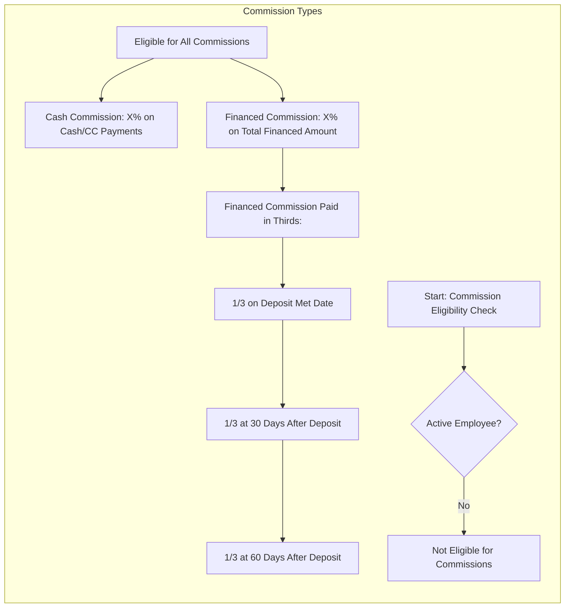

---

## 3: Self-Generated Leads Timeline

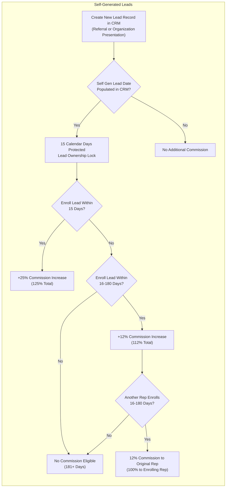

---

## 4: Commission Earned Conditions

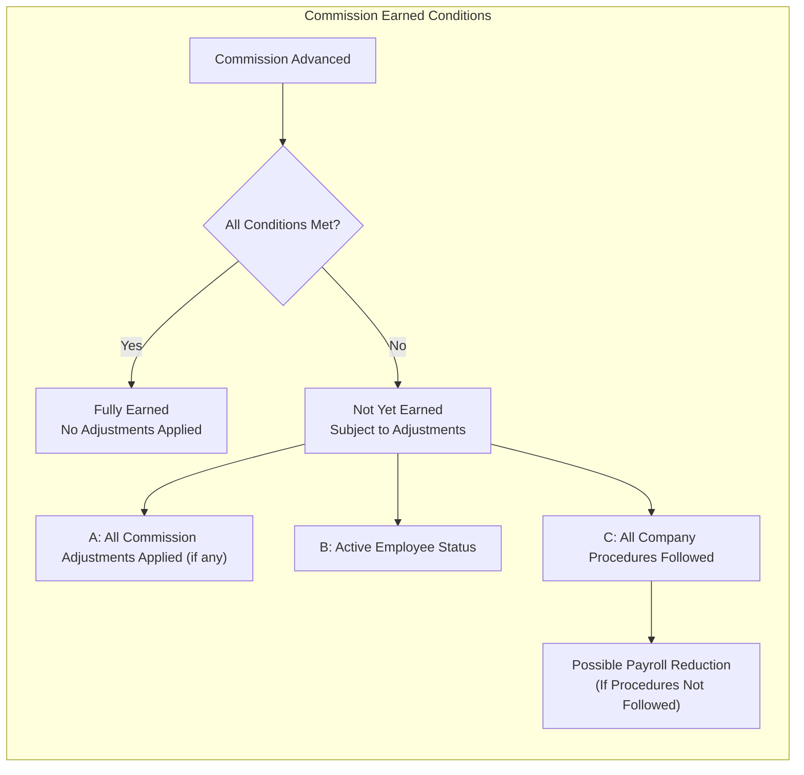

---

## 5.1: Withdrawal Requests (72 Hours)

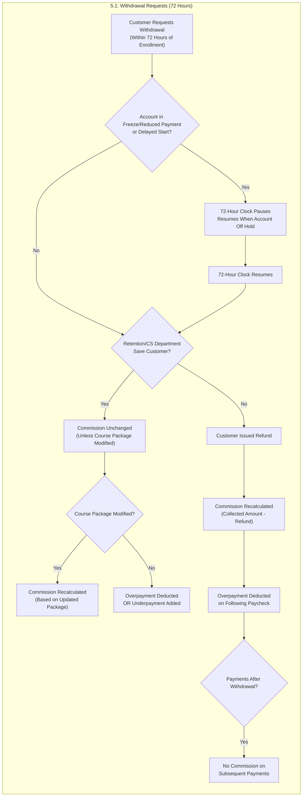

---

## 5.2: Deposit Payment Reversals

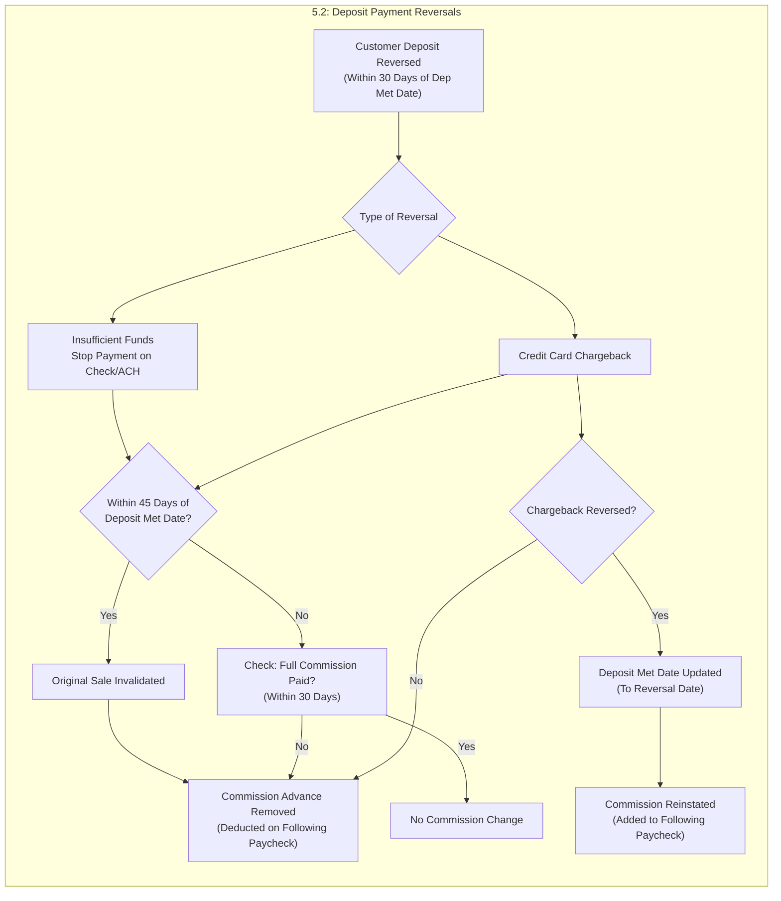

---

## 5.3: PIF Installment Payment Reversals

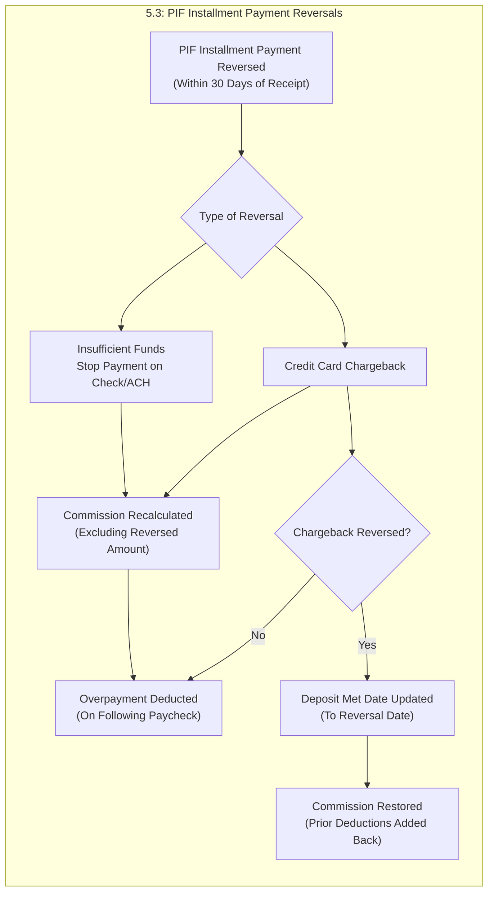

---

## 5.4: Account Status Changes

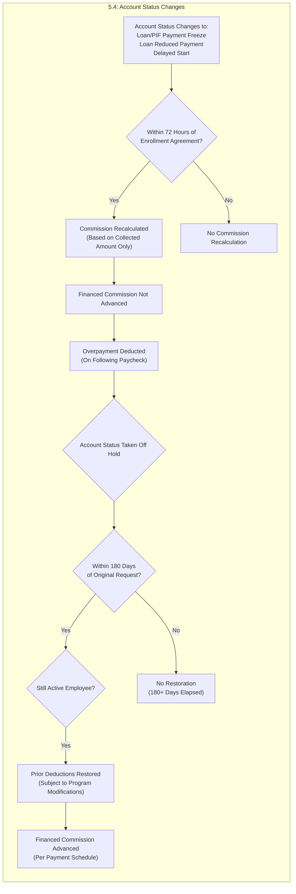

---

## 5.5: Program Modifications - Dropping Courses

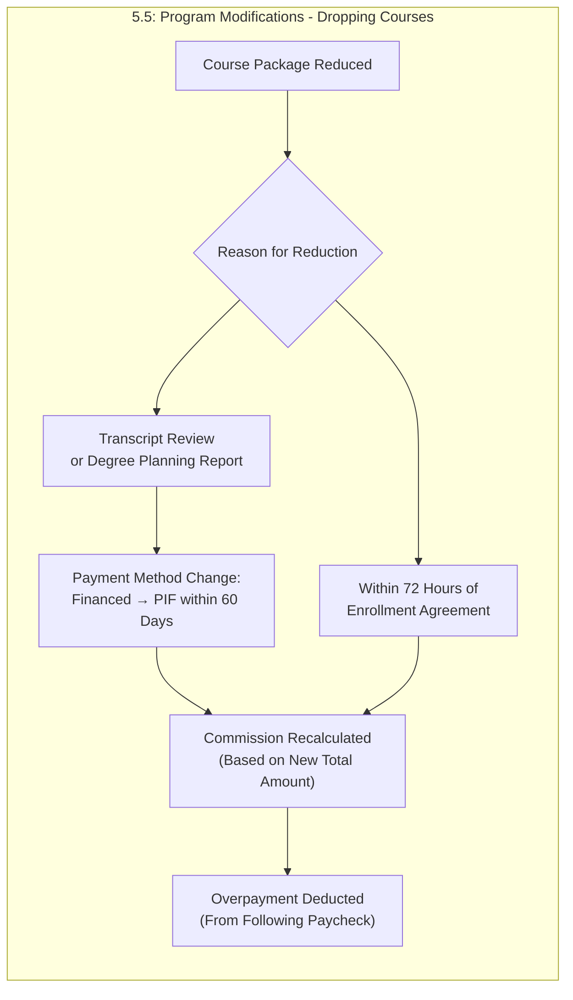

---

## 5.6: Program Modifications - Adding Courses

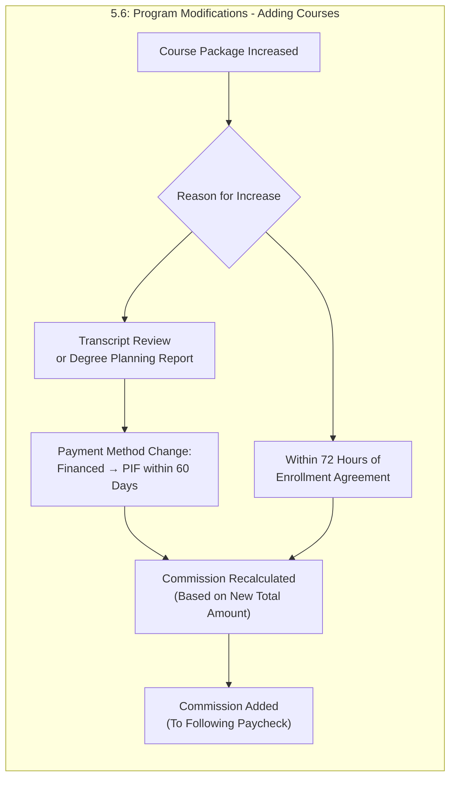

---

## 5.7: Payment Method Changes

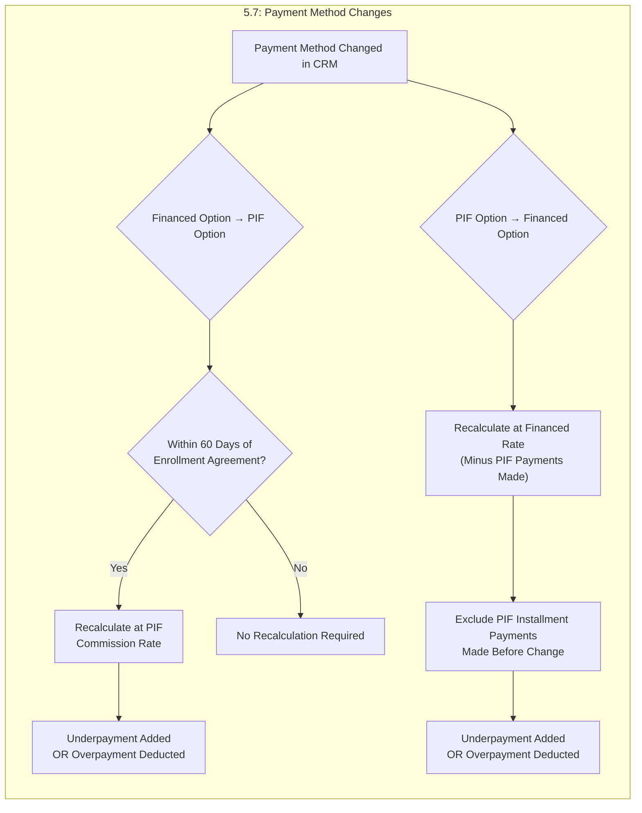

---

## 5.8: Financing Option with Financial Partner

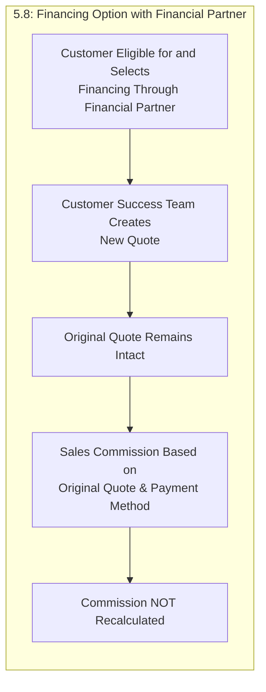

---

## 5.9: Good Faith Violations

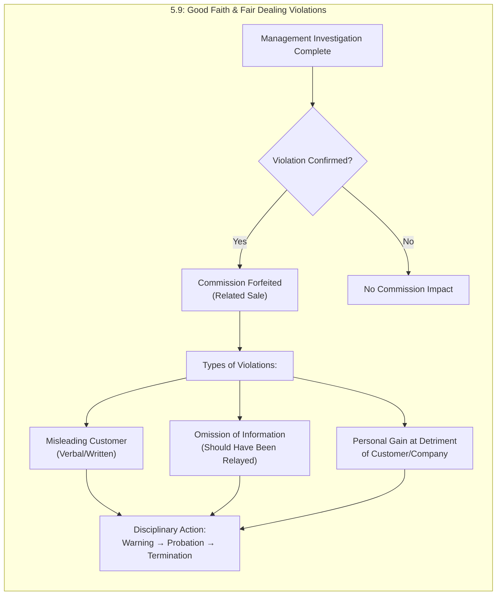

---

## 6: Draw Against Future Commissions

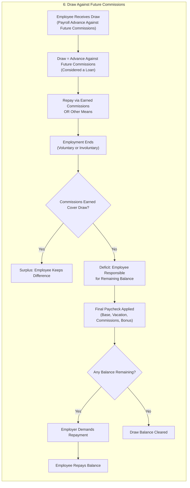

---

## 7: Booker Commissions

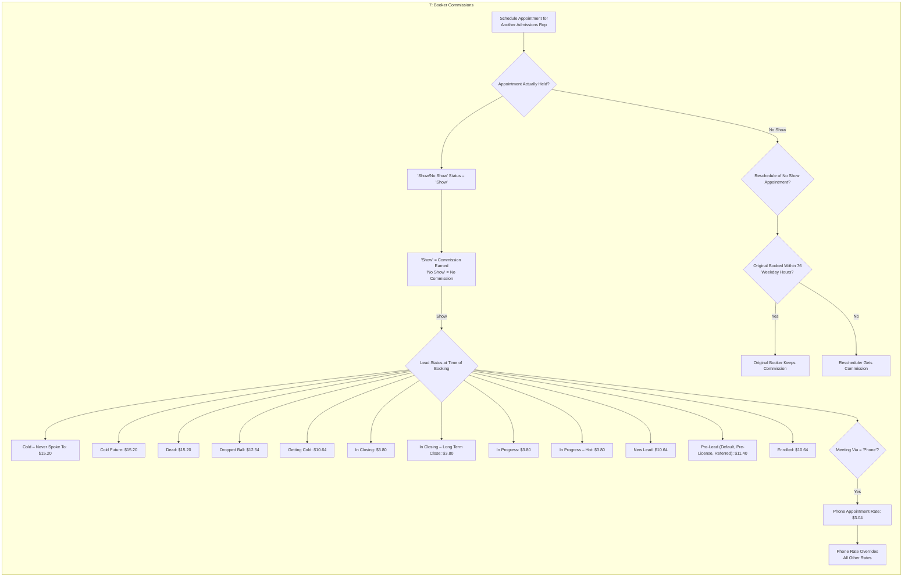

---

## 8: Payment of Commission

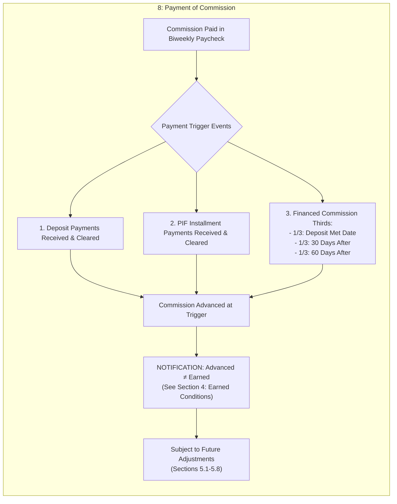

---

## 9: Sales Commission Sharing

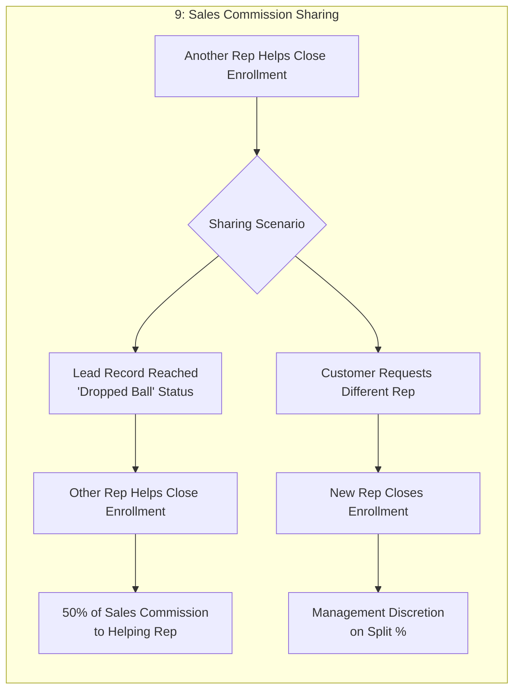

---

## 10: Entire Policy & Legal

```mermaid
flowchart TB
    subgraph LEGAL ["10: Entire Policy & Legal"]
        direction TB
        
        POLICY_COMPLETE["Entire Policy Document"]
        
        NO_OTHER["No Other Representations/Promises<br/>(Not in This Policy)"]
        
        NOT_GUARANTEE["NOT a Guarantee of<br/>Continuous Employment"]
        
        AT_WILL["Employee Remains At-Will<br/>(Unless State Law Says Otherwise)"]
        
        POLICY_AMEND{"Policy Changes"]
        
        WRITTEN_ONLY["Written Agreement Required<br/>(To Amend/Modify/Waive)"]
        
        COMPANY_RIGHT["Company May Change/Terminate<br/>At Any Time"]
        
        NOTICE_REQUIRED["Advance Written Notice<br/>Provided to Employees"]
        
        GOVERNING_LAW{"Unless Prohibited by Law"]
        
        NJ_LAW["Laws of New Jersey Govern"]
        
        JURISDICTION["Morris County, NJ Courts<br/>(Personal Jurisdiction & Venue)"]
        
        DISPUTE_RESOLUTION{"Dispute Resolution"]
        
        INDIVIDUAL_ONLY["Individual Basis Only<br/>(No Class Actions)"]
        
        NO_PGA["No Private Attorney General Actions<br/>(Unless Agreed in Writing)"]
        
        POLICY_COMPLETE --> NO_OTHER
        NO_OTHER --> NOT_GUARANTEE
        NOT_GUARANTEE --> AT_WILL
        AT_WILL --> POLICY_AMEND
        POLICY_AMEND --> WRITTEN_ONLY
        WRITTEN_ONLY --> COMPANY_RIGHT
        COMPANY_RIGHT --> NOTICE_REQUIRED
        NOTICE_REQUIRED --> GOVERNING_LAW
        GOVERNING_LAW --> NJ_LAW
        NJ_LAW --> JURISDICTION
        JURISDICTION --> DISPUTE_RESOLUTION
        DISPUTE_RESOLUTION --> INDIVIDUAL_ONLY
        INDIVIDUAL_ONLY --> NO_PGA
    end
```

---

## Salesforce Automation Rules

```mermaid
flowchart TB
    subgraph SALESFORCE ["Salesforce Commission Automation"]
        direction TB
        
        SF_START["Quote in Salesforce"]
        
        SF_RULE_1{"RULE 1: All Criteria Met?"]
        
        SF_COND_A["Accounting Active OR CT Active = Checked"]
        SF_COND_B["Dep Met = Checked AND Dep Met Date Populated"]
        SF_COND_C["Payment Status ≠ 'Withdraw - 72 hours'"]
        
        SF_ENABLE["Commission Automation ENABLED"]
        
        SF_DISABLE{"RULE 2: Automation Disabled?"]
        
        SF_FULL_PAID["Full Commission Potential<br/>Already Paid"]
        
        SF_30_DAYS{">30 Days After<br/>Deposit Met Date?"}
        
        SF_DISABLED["Commission Automation DISABLED<br/>(No Future Adjustments)"]
        
        SF_START --> SF_RULE_1
        SF_RULE_1 --> SF_COND_A
        SF_RULE_1 --> SF_COND_B
        SF_RULE_1 --> SF_COND_C
        SF_COND_A --> SF_ENABLE
        SF_COND_B --> SF_ENABLE
        SF_COND_C --> SF_ENABLE
        SF_ENABLE --> SF_DISABLE
        SF_DISABLE --> SF_FULL_PAID
        SF_DISABLE --> SF_30_DAYS
        SF_30_DAYS -->|Yes| SF_DISABLED
        SF_30_DAYS -->|No| SF_ENABLE
    end
```

---

## Commission Policy Overview (Summary Diagram)

```mermaid
flowchart TB
    subgraph OVERVIEW ["Commission Policy Overview"]
        direction TB
        
        START["Commission Policy<br/>For Admissions Reps"]
        
        ELIGIBILITY["1. Active Employee Required"]
        
        COMMISSION_TYPES["2. Commission Types:<br/>- Cash: X% on Cash/CC<br/>- Financed: X% in Thirds"]
        
        SELF_GEN["3. Self-Generated Leads:<br/>- 15 days protected<br/>- 16-180 days: +12%<br/>- 181+ days: 0%"]
        
        EARNED["4. Earned When:<br/>- Adjustments Applied<br/>- Active Employee<br/>- Procedures Followed"]
        
        ADJUSTMENTS["5. Adjustment Scenarios:<br/>- Withdrawals<br/>- Payment Reversals<br/>- Program Changes<br/>- Payment Method Changes<br/>- Good Faith Violations"]
        
        DRAW["6. Draw Repayment:<br/>- Loan Against Future Commissions<br/>- Repay at Termination"]
        
        BOOKER["7. Booker Commissions:<br/>- Schedule Appointments<br/>- Rates by Lead Status<br/>- Phone = $3.04 Override"]
        
        PAYMENT["8. Payment Timing:<br/>- Biweekly Paychecks<br/>- Triggered by Payments"]
        
        SHARING["9. Commission Sharing:<br/>- Dropped Ball Help: 50%<br/>- Customer Request: Discretionary"]
        
        LEGAL["10. Legal:<br/>- At-Will Employment<br/>- NJ Law Governs<br/>- Individual Dispute Resolution"]
        
        START --> ELIGIBILITY
        ELIGIBILITY --> COMMISSION_TYPES
        COMMISSION_TYPES --> SELF_GEN
        SELF_GEN --> EARNED
        EARNED --> ADJUSTMENTS
        ADJUSTMENTS --> DRAW
        DRAW --> BOOKER
        BOOKER --> PAYMENT
        PAYMENT --> SHARING
        SHARING --> LEGAL
    end
```

---

## Document Information

| Item | Value |
|------|-------|
| Policy Version | 10.27.2020 |
| Company | Gotham City Ventures LLC<br/>East Coast Test Prep LLC d/b/a Achieve Test Prep<br/>Achieve-it Management Corp |
| Document Type | Commission Policy Flowchart |
| Created From | Commission Policy.txt<br/>Commission Logic.txt |
