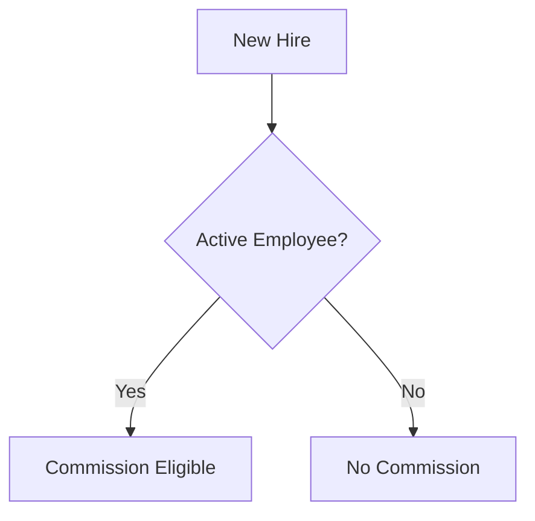
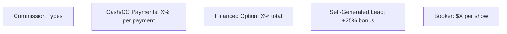
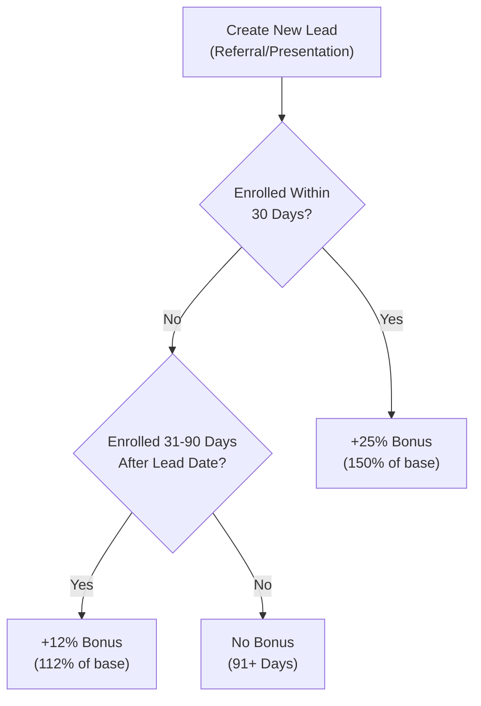
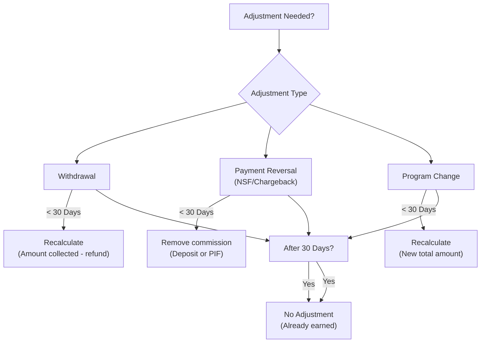
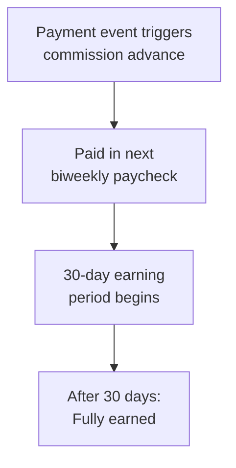
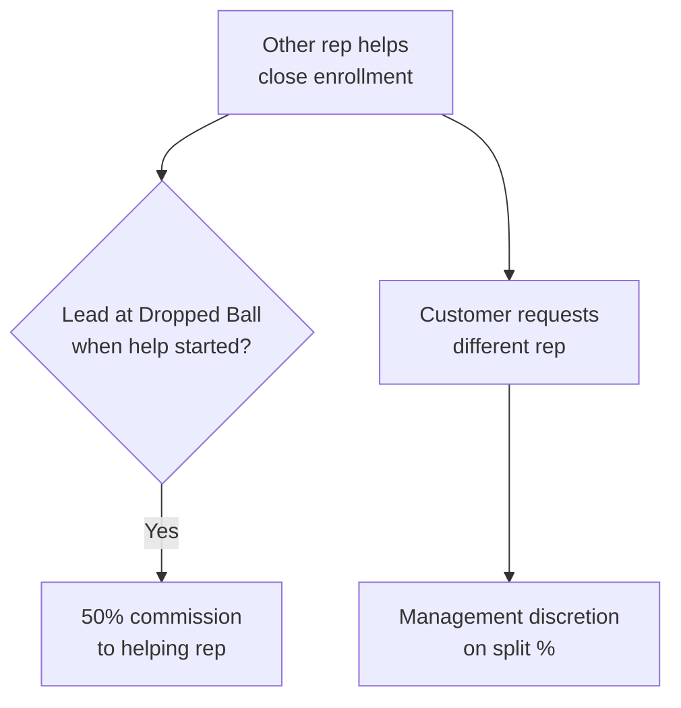
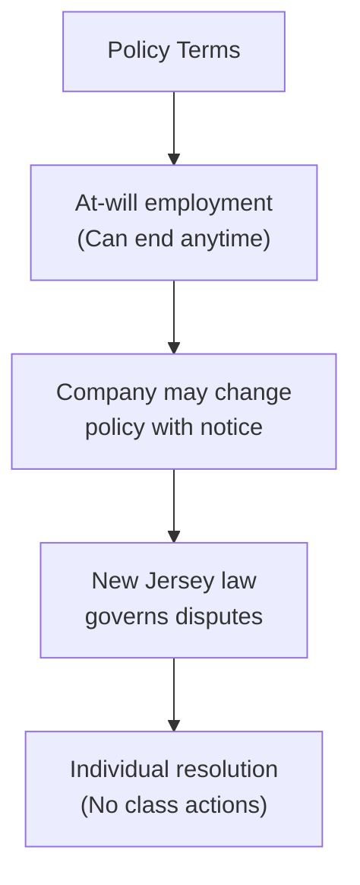

# Simplified Commission Policy Proposal

## Executive Summary

This document proposes a streamlined commission policy that maintains revenue protection while significantly reducing complexity for Admissions Representatives.

---

## Current Policy Complexity Issues

| Issue | Impact |
|-------|--------|
| 5+ different time windows (72hr, 30d, 45d, 60d, 180d) | Confusing, error-prone |
| 8+ adjustment scenarios | Hard to train, inconsistent application |
| Duplicate logic across sections | Redundant rules |
| Self-gen lead timeline | 3 distinct periods hard to track |
| Salesforce automation rules in policy | Implementation detail shouldn't be policy |

---

## Proposed Simplified Policy

### Core Principles

1. **One Adjustment Window**: 30 days for all adjustments
2. **One Self-Gen Timeline**: 30 days protected, then 60 days partial
3. **Clear Commission Triggers**: Payment received = commission triggered
4. **Simplified Earned Logic**: 30 days = fully earned
5. **Remove Implementation Details**: Salesforce rules belong in ops docs

---

## Proposed Policy v2.0

### 1. Eligibility



- Must be active employee to earn commissions
- Terminated employees (voluntary/involuntary) forfeit unearned commissions

---

### 2. Commission Types



| Type | Rate | Trigger |
|------|------|---------|
| Cash/CC | X% | Payment received & cleared |
| Financed | X% | 1/3 at deposit, 1/3 at 30d, 1/3 at 60d |
| Self-Gen Bonus | +25% | Lead enrolled within 30 days |
| Booker | $X per show | Appointment held |

---

### 3. Self-Generated Leads (Simplified)



**Key Changes:**
- Removed 15-day protected period (now 30 days)
- Simplified to 2 periods instead of 3
- 30 days is easier to remember than 15/180/181

---

### 4. Commission Earned (Simplified)

```mermaid
flowchart TB
    ADVANCE["Commission Advanced<br/>(When triggered)"]
    
    EARNING["30-Day Earning Period"]
    
    EARNED{"30 Days Passed?"]
    
    FINAL["Fully Earned<br/>No Adjustments"]
    
    ADJUST["Subject to Adjustments"]
    
    ADVANCE --> EARNING
    EARNING --> EARNED
    EARNED -->|Yes| FINAL
    EARNED -->|No| ADJUST
```

| Condition | Timing | Result |
|-----------|--------|--------|
| Advanced | Payment received | Yes |
| Active employee | Duration of earning period | Required |
| Procedures followed | Duration of earning period | Required |

**After 30 days**: Commission is final. No clawbacks, no adjustments.

---

### 5. Adjustments (Consolidated from 8 scenarios to 3)



| Scenario | < 30 Days | > 30 Days |
|----------|-----------|-----------|
| Customer withdraws | Recalculate based on collected | No change |
| Payment reversed (NSF/chargeback) | Remove commission | No change |
| Program modified (drop/add courses) | Recalculate new total | No change |

**Removed Complexity:**
- Removed separate 72-hour rules
- Removed account status freeze logic
- Removed payment method change window
- Removed good faith violations (handle via HR)

---

### 6. Draw Against Future Commissions (Unchanged)

```mermaid
flowchart TB
    DRAW["Receive Draw<br/>(Payroll advance)"]
    
    EARN_COMM["Earn commissions<br/>(Apply to draw balance)"]
    
    END{"Employment ends?"]
    
    COVERED["Draw covered<br/>by commissions"]
    
    BALANCE["Balance remains"]
    
    FINAL_PAY["Final paycheck<br/>(Applied to balance)"]
    
    OWES["Employee owes<br/>remaining balance"]
    
    DRAW --> EARN_COMM
    EARN_COMM --> END
    END -->|Yes| COVERED
    COVERED -->|Yes| BALANCE
    BALANCE -->|No| DONE["Complete"]
    BALANCE -->|Yes| FINAL_PAY
    FINAL_PAY --> OWES
```

---

### 7. Booker Commissions (Simplified)

```mermaid
flowchart TB
    BOOK["Schedule appointment<br/>for another rep"]
    
    HELD{"Appointment held?"]
    
    SHOW["Show status = Show"]
    
    RATE{"Lead status at booking"]
    
    PHONE{"Phone appointment?"]
    
    RATES["Rates by status:<br/>Hot: $X<br/>Warm: $Y<br/>Cold: $Z"]
    
    PHONE_RATE["Phone rate: $3.04<br/>(Overrides all)"]
    
    NO_SHOW["No commission<br/>(No show)"]
    
    BOOK --> HELD
    HELD -->|Yes| SHOW
    SHOW --> RATE
    RATE --> PHONE
    PHONE -->|Yes| PHONE_RATE
    PHONE -->|No| RATES
    HELD -->|No| NO_SHOW
```

| Lead Status | Commission |
|-------------|------------|
| In Closing / Hot / Long Term Close | $3.80 |
| New Lead / Enrolled | $10.64 |
| Pre-Lead (Default, Pre-License, Referred) | $11.40 |
| Getting Cold | $10.64 |
| Dropped Ball | $12.54 |
| Cold Future / Dead / Never Spoke To | $15.20 |
| Phone Appointment | $3.04 (override) |

**Simplified**: Removed "76 weekday hours" complexity for rescheduled no-shows.

---

### 8. Payment Timing



| Event | When Paid |
|-------|-----------|
| Deposit received | Next paycheck |
| PIF payment received | Next paycheck |
| Financed payment (1/3, 2/3, 3/3) | Next paycheck |

---

### 9. Commission Sharing



---

### 10. Policy Terms (Simplified)



- Not a guarantee of employment
- At-will employment maintained
- Company can change policy with advance written notice
- New Jersey law governs
- Individual dispute resolution only

---

## Comparison: Current vs. Proposed

| Aspect | Current | Proposed |
|--------|---------|----------|
| Adjustment windows | 5+ (72hr, 30d, 45d, 60d, 180d) | 1 (30d) |
| Self-gen timeline | 3 periods (15, 16-180, 181+) | 2 periods (30, 31-90) |
| Adjustment scenarios | 8 distinct | 3 consolidated |
| Policy length | ~7 pages | ~3 pages |
| Salesforce rules | Included | Moved to ops docs |
| 72-hour rules | Multiple | Removed (merged to 30d) |

---

## Implementation Recommendations

### Phase 1: Immediate Simplification
1. Consolidate 8 adjustment scenarios into 3
2. Extend self-gen protection to 30 days
3. Remove Salesforce automation from policy
4. Create summary card with key numbers

### Phase 2: Policy Rewrite
1. Rewrite all sections with simplified language
2. Remove redundant clauses
3. Add decision trees where helpful
4. Create quick-reference guide

### Phase 3: Training & Communication
1. Train managers on simplified policy
2. Create FAQ document
3. Update CRM help text
4. Develop calculator tools

---

## Key Numbers Summary Card

| Metric | Value |
|--------|-------|
| Adjustment Window | 30 days |
| Self-Gen Protection | 30 days (+25%) |
| Self-Gen Partial | 31-90 days (+12%) |
| Commission Finalization | 30 days |
| Booker Phone Rate | $3.04 |
| Payment Method Change | Recalculate immediately |

---

## Questions for Stakeholders

1. Is the 30-day adjustment window sufficient for revenue protection?
2. Should we extend self-gen protection beyond 30 days?
3. Are the proposed booker rates competitive?
4. Should good faith violations be handled separately (HR) or in commission policy?
5. Is the 50/50 split for dropped ball leads appropriate?

---

## Appendix: Removed Policies

The following were removed from v2.0 as they are implementation details or redundant:

| Section | Reason |
|---------|--------|
| 5.1: 72-hour withdrawal freeze clock | Merged to 30-day standard |
| 5.2: 45-day deposit reversal threshold | Merged to 30-day standard |
| 5.3: PIF installment reversals | Merged to payment reversals |
| 5.4: Account status changes (freeze/reduced/delayed) | Merged to 30-day standard |
| 5.5: 72-hour program changes | Merged to 30-day standard |
| 5.6: Transcript/DPR program changes | Merged to 30-day standard |
| 5.7: 60-day payment method changes | Removed - recalculate immediately |
| 5.8: Financing option changes | Redundant - already covered |
| 5.9: Good faith violations | Move to HR policy |
| Salesforce Automation Rules | Move to ops documentation |
| 76-hour reschedule rule | Removed for simplicity |
